# The Friend Zone
   
  ## Table of Contents:
  [Description](#description) 
  [Installation](#installation) 
  [Usage](#usage) 
  [Contributing](#contributing) 
  [Tests](#tests) 
  [License](#license) 
  [Questions](#questions) 

  # Description
  A social network API - That you didn't know you needed! 
  Here is a video walkthrough: [Walkthrough](https://vimeo.com/710215955/c70cfed952)

## Here are some screen captures of the functionality  
### Get All Users
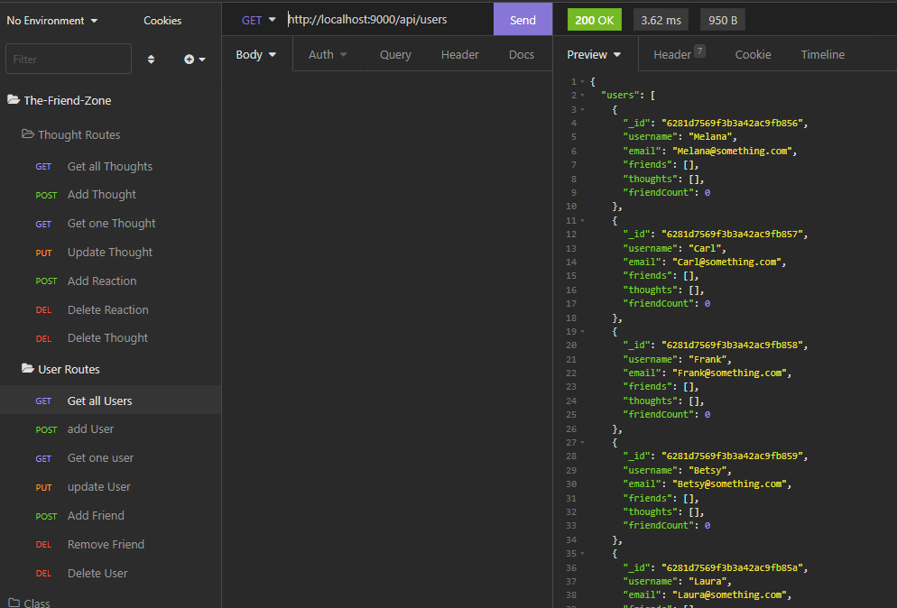 

### Get One User
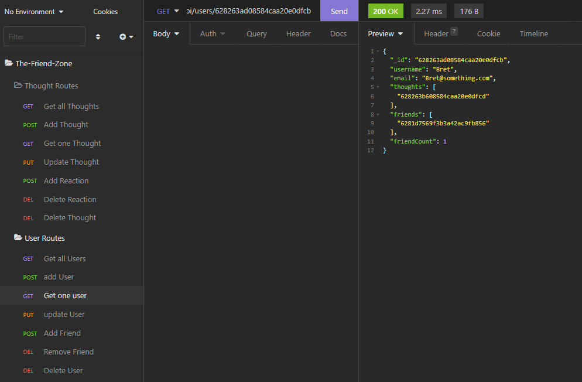 

### Add User
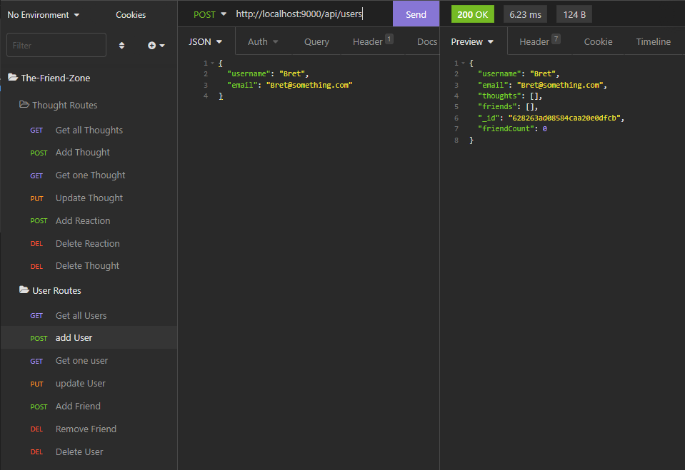 

### Delete User
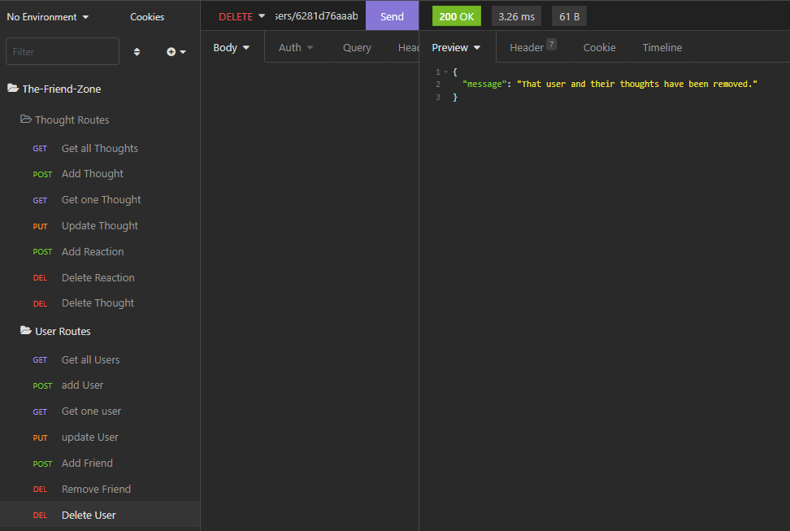 

### Update User
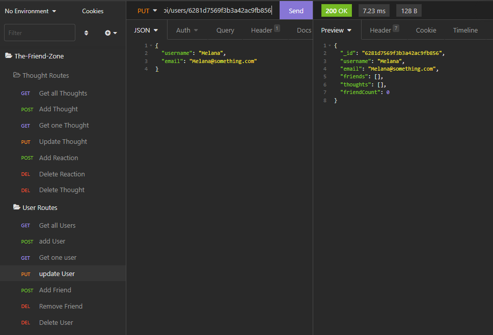 

### Add Friend
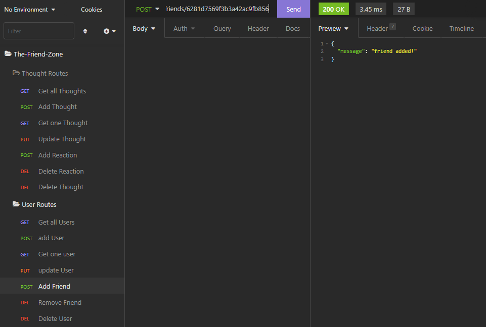 

### Remove Friend
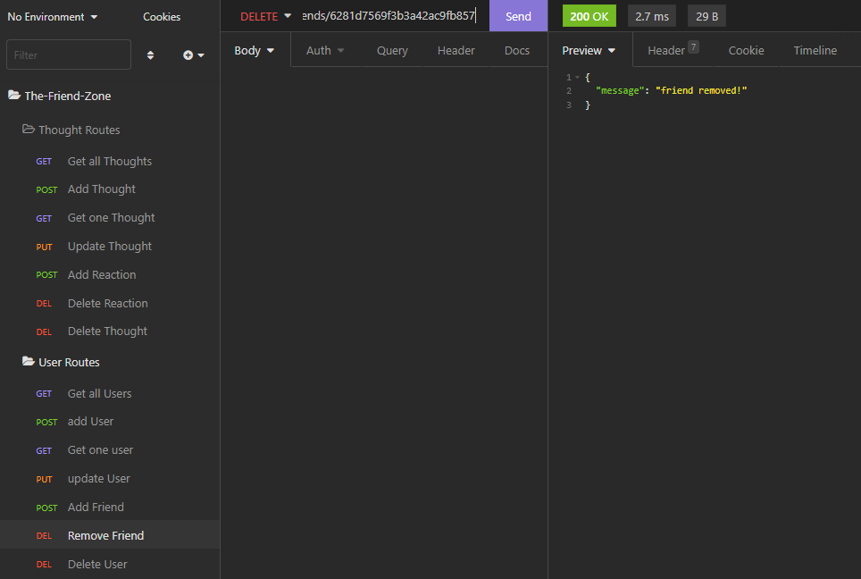 

### Get All Thoughts
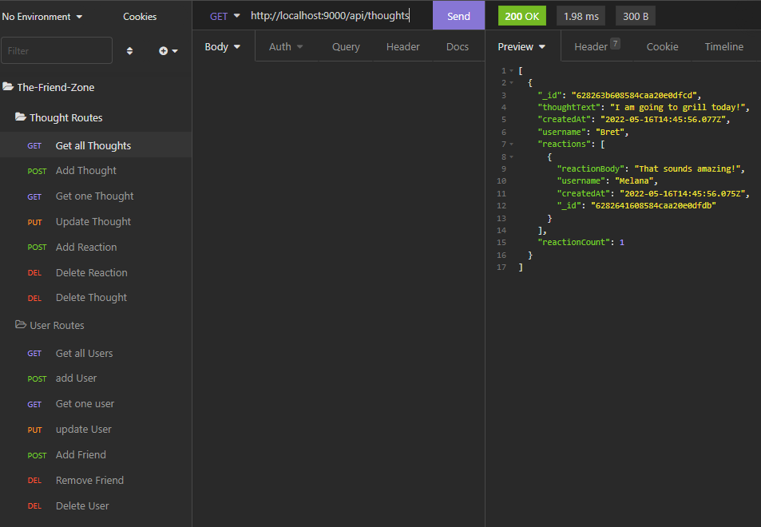 

### Get One Thought
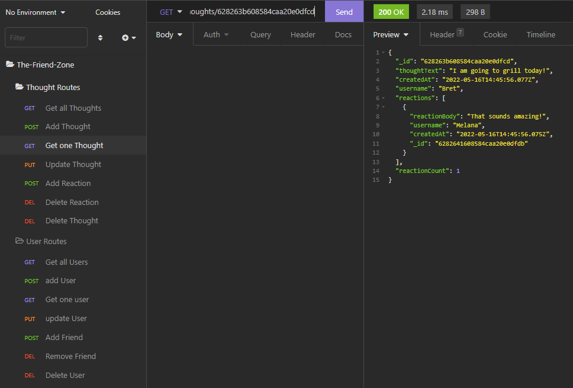 

### Add Thought
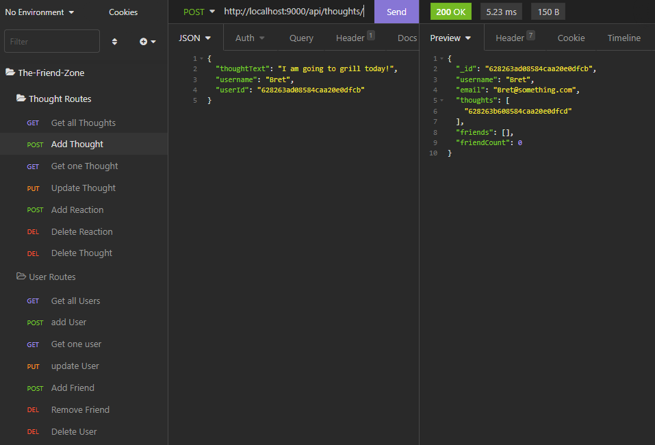 

### Update Thought
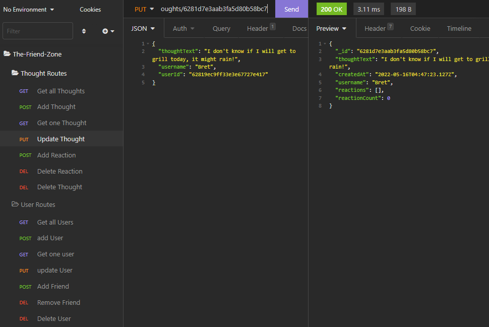 

### Remove Thought
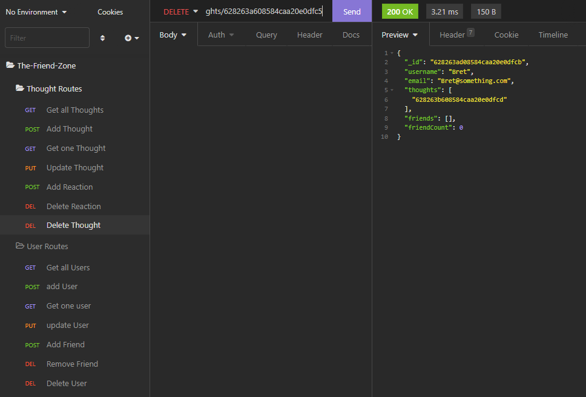 

### Add Reaction
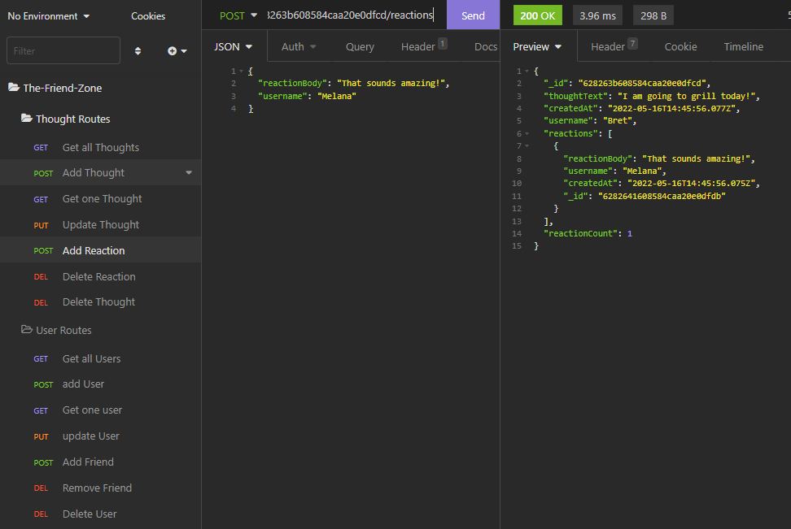 

### Remove Reaction
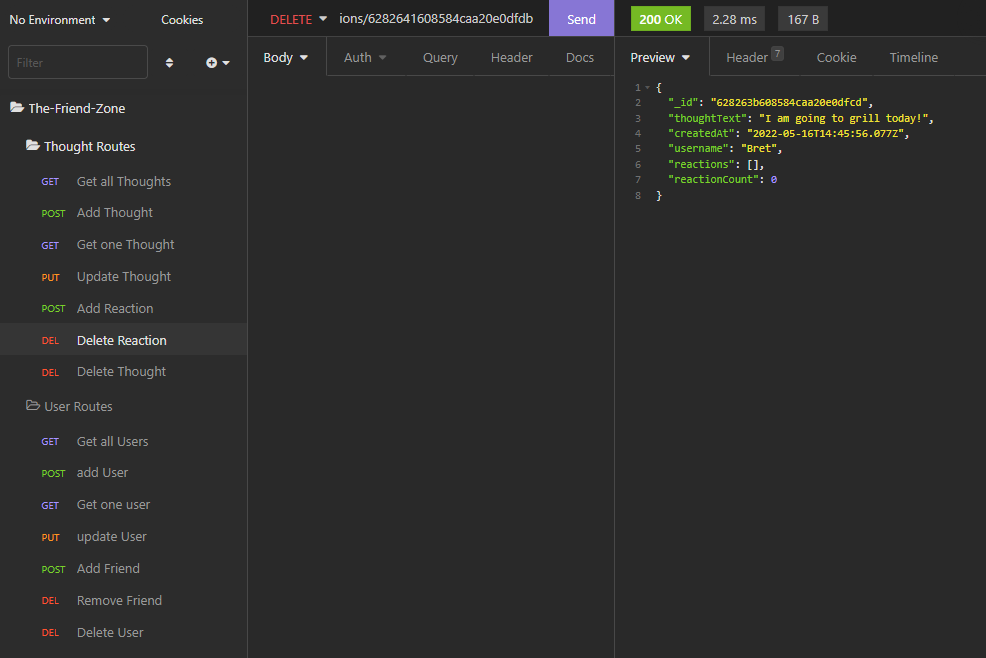 

  # Installation
  No installation.
  # Usage
  Free to use.
  # Contributing
  If you wish to contribute, please fork this repo first.
  # Tests
  Testing not yet implemented.
  # License
  [The MIT license](https://opensource.org/licenses/MIT)
  
    Copyright 2022 Bret Banger
    
    Permission is hereby granted, free of charge, to any person obtaining a copy of this software and associated documentation files (the "Software"), to deal in the Software without restriction, including without limitation the rights to use, copy, modify, merge, publish, distribute, sublicense, and/or sell copies of the Software, and to permit persons to whom the Software is furnished to do so, subject to the following conditions:
    
    The above copyright notice and this permission notice shall be included in all copies or substantial portions of the Software.
    
    THE SOFTWARE IS PROVIDED "AS IS", WITHOUT WARRANTY OF ANY KIND, EXPRESS OR IMPLIED, INCLUDING BUT NOT LIMITED TO THE WARRANTIES OF MERCHANTABILITY, FITNESS FOR A PARTICULAR PURPOSE AND NONINFRINGEMENT. IN NO EVENT SHALL THE AUTHORS OR COPYRIGHT HOLDERS BE LIABLE FOR ANY CLAIM, DAMAGES OR OTHER LIABILITY, WHETHER IN AN ACTION OF CONTRACT, TORT OR OTHERWISE, ARISING FROM, OUT OF OR IN CONNECTION WITH THE SOFTWARE OR THE USE OR OTHER DEALINGS IN THE SOFTWARE.
  # Questions
  ### GitHub Username: [Banger484](https://github.com/Banger484) 
  ### Email Address:   Banger484@gmail.com 
  If you have any additional questions, you send an email to the address provided above.

